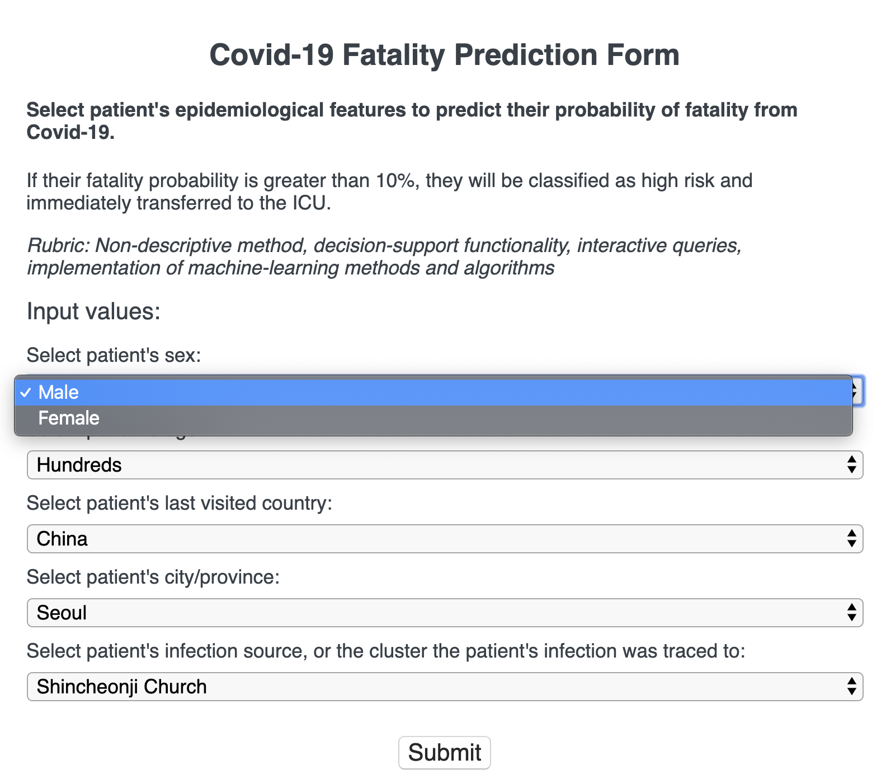

# Covid-19 Patient Fatality Risk Classification Prediction Web App

## Description

This web app uses machine learning to classify Covid-19 patients as low risk or high risk for fatality based on patients' epidemiological parameters. Using machine learning to automate risk assessment could hypothetically help hospitals process and treat patients more efficiently, maximize utilization of limited resources, and improve patient outcome.

A Jupyter Notebook is used as the machine learning environment. The data source is Covid-19 patient data from Korea’s CDC and local governments (https://www.kaggle.com/kimjihoo/coronavirusdataset). After the dataset is cleaned and transformed with pandas, it is used to train a classification prediction model with Scikit-learn. After the prediction model is optimized, it is exported as a pickle file so it can be used in the back-end of the web app.

User input is entered in the front-end of the web app and passed to the back-end with Flask. In the back-end, the prediction model takes user input and outputs predictions. The output is passed back to the front-end with a Flask templating engine called jinja.

There are also graphs and charts created with pandas, Matplotlib, and seaborn that visually summarize Korea’s Covid-19 patient data and data analysis.



## Demo

This site may take a while to load because it is hosted on Heroku's free plan and therefore gets unloaded from Heroku's server memory if there is no web traffic for a certain period.
https://covid-19-fatality-predictor.herokuapp.com/

<!-- ## Features -->

## Tech Stack

- HTML / CSS
- Python
- Flask
- Jupyter Notebook

## Setup

Install Python 3 with the official installer (recommended).
https://www.python.org/downloads/

Or install using Homebrew package manager (macOS only).

```
brew update && brew upgrade
brew install python3
```

Install miniconda3 package from official website to use conda.
https://docs.conda.io/en/latest/miniconda.html

Move to project directory

```
cd ml-ds-js
```

Create a virtual environment

```
# If using venv:
python -m venv env

# If using conda:
conda create --prefix ./env
```

Activate virtual environment

```
# If using venv:
source env/bin/activate

# If using conda:
conda env list # See list of environments
conda activate /<filepath>/env
```

Install dependencies

```
# If using venv:
pip install -r requirements.txt

# If using conda:
conda install pip
which pip # Make sure it is environment pip, not global pip
pip install -r requirements.txt
```

### Setup web app

Start server

```
python app.py
```

Stop server

```
ctrl + c
```

### Setup Jupyter Notebook

Start server

```
jupyter notebook
```

Stop server

```
ctrl + c
```

## Lessons Learned
